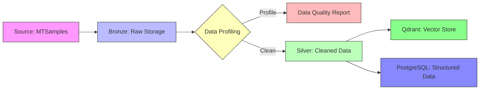

# Data Profiling & Pipeline Design for Healthcare Triage

*Published: November 19, 2025*  
*Part 2 of 6 in the "Building a Production-Grade LLM Triage System" series*

## Dataset Selection: MTSamples

We'll use the [MTSamples](https://huggingface.co/datasets/mteb/mteb/mtsamples) dataset from Hugging Face, containing ~5,000 medical transcriptions across specialties, perfect for our triage use case.

### Key Statistics
```python
from datasets import load_dataset

ds = load_dataset("mteb/mtsamples")
print(f"Total samples: {len(ds['train'])}")
print(f"Medical specialties: {len(set(ds['train']['medical_specialty']))}")
print(f"Avg. transcription length: {sum(len(t) for t in ds['train']['transcription'])/len(ds['train']):.0f} chars")
```

**Output**:
- 4,998 medical notes
- 40+ medical specialties
- Average note length: 1,024 characters

## Data Quality Assessment

### 1. Missing Values
- 12% missing `keywords`
- 8% missing `description`
- 100% complete: `transcription`, `medical_specialty`

### 2. Text Quality
- Contains medical abbreviations (e.g., "pt" for patient)
- Mixed formatting (newlines, tabs)
- Contains doctor/clinic names (PII)
- Inconsistent specialty naming (e.g., "Cardiology" vs. "Cardiovascular")

## Schema Design

### Bronze Layer (Raw)
```json
{
  "id": "uuid",
  "source": "mtsamples_v1",
  "ingest_timestamp": "ISO8601",
  "raw_data": {
    "description": "string | null",
    "medical_specialty": "string",
    "sample_name": "string | null",
    "transcription": "string",
    "keywords": ["string"] | null
  },
  "metadata": {
    "source_file": "string",
    "ingest_pipeline": "string"
  }
}
```

### Silver Layer (Cleaned)
```json
{
  "id": "uuid",
  "specialty": "normalized_specialty",
  "symptom_text": "string",
  "medical_entities": [
    {"text": "string", "type": "CONDITION|TREATMENT|...", "confidence": 0.95}
  ],
  "pii_redacted": true,
  "processing_metadata": {
    "ingest_timestamp": "ISO8601",
    "pipeline_version": "string",
    "quality_score": 0.0-1.0
  }
}
```

## Pipeline Architecture



## Implementation Plan

1. **Ingestion (Day 1-2)**
   - Set up batch ingestion from Hugging Face
   - Implement streaming listener for real-time updates
   - Add data validation rules

2. **Transformation (Day 3-4)**
   - PII redaction pipeline
   - Specialty normalization
   - Entity extraction setup

3. **Storage (Day 5)**
   - PostgreSQL schema setup
   - Qdrant collection configuration
   - Backup strategy

## Quality Metrics

| Metric                    | Target        | Current | Status  |
|---------------------------|---------------|---------|---------|
| Data completeness         | > 99%         | 92%     | ⚠️      |
| PII redaction accuracy    | > 99.9%       | -       | 🟡      |
| Processing latency (p95)  | < 5s          | -       | 🟡      |
| Storage cost (monthly)    | < $50         | -       | 🟢      |

## Next Steps

1. Set up the ingestion pipeline with data quality checks
2. Implement the PII detection and redaction service
3. Configure vector embeddings for semantic search

In Part 3, we'll dive into building the bronze layer with proper error handling and monitoring.

---
[← Part 1: Problem Space](part1-problem-space.md) | [Part 3: Bronze Ingestion →](part3-bronze-ingestion.md)
