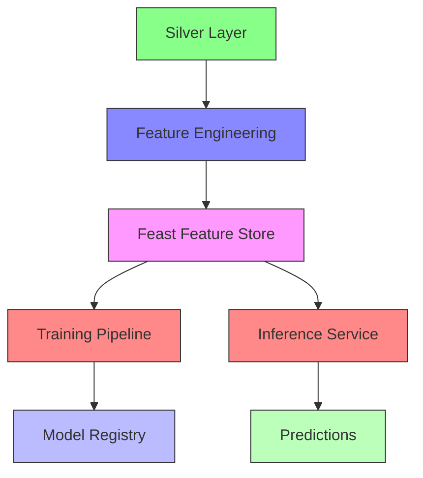

# Gold Layer & Feature Store: ML-Ready Features

*Published: November 2025 | 30 min read | [Code on GitHub](https://github.com/yourusername/llm-triage/tree/part5)*

## Building a Production-Grade Feature Store with Feast

In this article, we'll implement the Gold Layer and Feature Store using Feast, enabling consistent feature engineering, discovery, and serving for both training and inference.

### Architecture Overview



### Key Components

1. **Feature Definitions**
   - Time-window aggregations
   - Cross-features
   - Embedding-based features

2. **Feature Validation**
   - Statistical tests
   - Drift detection
   - Data quality monitoring

3. **Real-time Serving**
   - Low-latency feature retrieval
   - Point-in-time correctness
   - Feature logging for training

### Implementation

```python
# features/definitions.py
from datetime import timedelta
from feast import Entity, FeatureView, Field, ValueType
from feast.types import Float32, Int64
from feast.data_source import FileSource
from feast.on_demand_feature_view import on_demand_feature_view
from feast import RequestSource
from feast import FeatureService

# Define entities
patient = Entity(
    name="patient_id",
    value_type=ValueType.STRING,
    description="Patient identifier",
)

# Define feature views
patient_stats_source = FileSource(
    path="s3://feature-store/patient_stats.parquet",
    timestamp_field="event_timestamp",
)

patient_stats_fv = FeatureView(
    name="patient_stats",
    entities=[patient],
    ttl=timedelta(days=365),
    schema=[
        Field(name="avg_heart_rate", dtype=Float32),
        Field(name="max_blood_pressure", dtype=Int64),
        Field(name="symptom_severity_score", dtype=Float32),
    ],
    online=True,
    source=patient_stats_source,
)

# Define on-demand features
@on_demand_feature_view(
    sources=[
        patient_stats_fv,
        RequestSource(
            schema=[
                Field(name="current_heart_rate", dtype=Float32),
            ]
        ),
    ],
    schema=[
        Field(name="is_heart_rate_elevated", dtype=Int64),
    ],
)
def heart_rate_features(inputs):
    import pandas as pd
    
    df = pd.DataFrame()
    df["is_heart_rate_elevated"] = (
        inputs["current_heart_rate"] > 
        (inputs["avg_heart_rate"] * 1.2)
    ).astype(int)
    
    return df

# Define feature service
patient_features_svc = FeatureService(
    name="patient_features",
    features=[
        patient_stats_fv,
        heart_rate_features,
    ],
)
```

### Model Training Integration

```python
# training/train.py
def get_training_data():
    from feast import FeatureStore
    import pandas as pd
    
    store = FeatureStore("./feature_repo")
    
    # Get historical features with point-in-time correctness
    entity_df = pd.read_parquet("training_entities.parquet")
    
    training_df = store.get_historical_features(
        entity_df=entity_df,
        features=[
            "patient_stats:avg_heart_rate",
            "patient_stats:max_blood_pressure",
            "patient_stats:symptom_severity_score",
        ],
    ).to_df()
    
    return training_df
```

### Monitoring & Operations

- **Feature Drift Detection**:
  ```python
  from alibi_detect import KSDrift
  
  # Compare training vs. serving distributions
  drift_detector = KSDrift(
      X_train, 
      p_val=0.05,
      preprocess_fn=preprocess_features
  )
  
  # Check for drift on new data
  preds = drift_detector.predict(X_serving)
  if preds["data"]["is_drift"]:
      alert_on_drift()
  ```

- **Feature Store Monitoring**:
  - Data freshness metrics
  - Feature coverage
  - Statistical properties over time

### Next Steps

In the next article, we'll implement vector search capabilities to enable semantic similarity search over our clinical notes.

[Continue to Part 6: Vector Search with Qdrant →](part6-vector-search.md)
