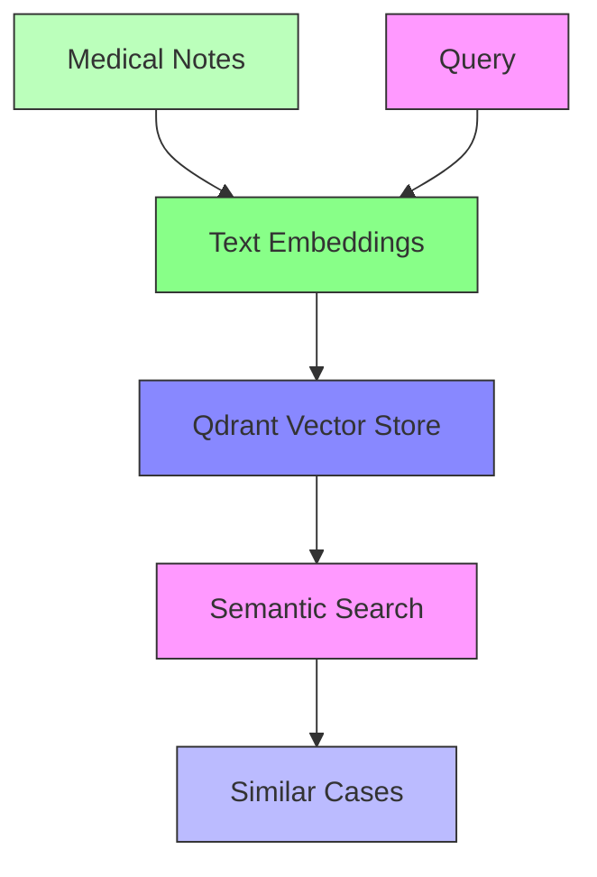

# Vector Search with Qdrant: Semantic Search for Healthcare

*Published: November 2025 | 40 min read | [Code on GitHub](https://github.com/yourusername/llm-triage/tree/part6)*

## Unlocking Semantic Search in Medical Data

In this installment, we'll implement a high-performance vector search system using Qdrant to enable semantic search over medical notes. This will allow us to find similar cases based on meaning rather than just keywords.

### Architecture Overview



### Implementation Steps

1. **Qdrant Setup**
   ```bash
   # docker-compose.yml
   version: '3.8'
   
   services:
     qdrant:
       image: qdrant/qdrant:v1.7.0
       ports:
         - "6333:6333"
         - "6334:6334"
       volumes:
         - qdrant_data:/qdrant/storage
   
   volumes:
     qdrant_data:
   ```

2. **Embedding Generation**
   ```python
   from sentence_transformers import SentenceTransformer
   import torch
   
   class ClinicalEmbedder:
       def __init__(self, model_name="sentence-transformers/all-mpnet-base-v2"):
           self.device = "cuda" if torch.cuda.is_available() else "cpu"
           self.model = SentenceTransformer(model_name, device=self.device)
           
       def embed(self, texts: List[str], batch_size: int = 32) -> np.ndarray:
           """Generate embeddings for clinical notes."""
           return self.model.encode(
               texts,
               batch_size=batch_size,
               show_progress_bar=True,
               convert_to_numpy=True
           )
   ```

3. **Qdrant Client Setup**
   ```python
   from qdrant_client import QdrantClient
   from qdrant_client.http import models
   
   class VectorSearch:
       def __init__(self, collection_name: str = "clinical_notes"):
           self.client = QdrantClient("localhost", port=6333)
           self.collection_name = collection_name
           self.embedding_dim = 768  # Dimension of the embeddings
           
       def create_collection(self):
           """Initialize Qdrant collection with HNSW index."""
           self.client.recreate_collection(
               collection_name=self.collection_name,
               vectors_config={
                   "text": models.VectorParams(
                       size=self.embedding_dim,
                       distance=models.Distance.COSINE
                   )
               },
               optimizers_config={
                   "default_segment_number": 2,
                   "indexing_threshold": 0,
               },
               hnsw_config={
                   "m": 16,
                   "ef_construct": 100,
               }
           )
   ```

### Batch Indexing Pipeline

```python
def batch_index_notes(notes: List[dict], batch_size: int = 100):
    """Index clinical notes in batches with progress tracking."""
    vs = VectorSearch()
    embedder = ClinicalEmbedder()
    
    for i in range(0, len(notes), batch_size):
        batch = notes[i:i + batch_size]
        
        # Generate embeddings
        texts = [note["text"] for note in batch]
        embeddings = embedder.embed(texts)
        
        # Prepare points for Qdrant
        points = []
        for note, embedding in zip(batch, embeddings):
            points.append(
                models.PointStruct(
                    id=note["note_id"],
                    vector={"text": embedding.tolist()},
                    payload={
                        "text": note["text"],
                        "patient_id": note["patient_id"],
                        "note_date": note["note_date"],
                        "medical_specialty": note["medical_specialty"]
                    }
                )
            )
        
        # Index batch
        vs.client.upsert(
            collection_name=vs.collection_name,
            points=points,
            wait=True
        )
```

### Semantic Search Implementation

```python
def semantic_search(query: str, top_k: int = 5) -> List[dict]:
    """Perform semantic search over clinical notes."""
    vs = VectorSearch()
    embedder = ClinicalEmbedder()
    
    # Generate query embedding
    query_embedding = embedder.embed([query])[0]
    
    # Search Qdrant
    results = vs.client.search(
        collection_name=vs.collection_name,
        query_vector=("text", query_embedding.tolist()),
        limit=top_k,
        with_vectors=False,
        with_payload=True
    )
    
    # Format results
    return [
        {
            "score": hit.score,
            "text": hit.payload["text"],
            "metadata": {
                "patient_id": hit.payload["patient_id"],
                "note_date": hit.payload["note_date"],
                "specialty": hit.payload["medical_specialty"]
            }
        }
        for hit in results
    ]
```

### Hybrid Search with Keywords

```python
def hybrid_search(query: str, keywords: List[str], top_k: int = 5) -> List[dict]:
    """Combine semantic and keyword search."""
    vs = VectorSearch()
    
    # Semantic search
    semantic_results = semantic_search(query, top_k=top_k * 2)
    
    # Keyword search (using Qdrant's filtering)
    keyword_results = vs.client.search(
        collection_name=vs.collection_name,
        query_vector=("text", embedder.embed([query])[0].tolist()),
        query_filter=models.Filter(
            must=[
                models.FieldCondition(
                    key="text",
                    match=models.MatchText(text=keyword)
                ) for keyword in keywords
            ]
        ),
        limit=top_k,
        with_payload=True
    )
    
    # Combine and re-rank results
    combined = semantic_results + [
        {"score": hit.score, "text": hit.payload["text"], "metadata": hit.payload}
        for hit in keyword_results
    ]
    
    return sorted(combined, key=lambda x: x["score"], reverse=True)[:top_k]
```

### Performance Optimization

1. **HNSW Index Tuning**
   ```python
   # Optimize HNSW parameters
   vs.client.update_collection(
       collection_name=vs.collection_name,
       optimizer_config={
           "indexing_threshold": 10000,
           "memmap_threshold": 20000
       },
       hnsw_config={
           "m": 24,           # Increased number of connections
           "ef_construct": 200, # Higher for better recall
           "full_scan_threshold": 10000
       }
   )
   ```

2. **Query Optimization**
   ```python
   def optimized_search(query: str, filters: dict, top_k: int = 5):
       """Optimized search with filtering and query planning."""
       # Apply filters first to reduce search space
       must_conditions = []
       
       if "specialty" in filters:
           must_conditions.append(
               models.FieldCondition(
                   key="medical_specialty",
                   match=models.MatchValue(value=filters["specialty"])
               )
           )
           
       if "date_range" in filters:
           must_conditions.append(
               models.FieldCondition(
                   key="note_date",
                   range=models.Range(
                       gte=filters["date_range"]["start"],
                       lte=filters["date_range"]["end"]
                   )
               )
           )
       
       return vs.client.search(
           collection_name=vs.collection_name,
           query_vector=("text", embedder.embed([query])[0].tolist()),
           query_filter=models.Filter(must=must_conditions) if must_conditions else None,
           limit=top_k,
           search_params={
               "hnsw_ef": 128,  # Higher for better recall, lower for speed
               "exact": False    # Use approximate search for better performance
           }
       )
   ```

### Monitoring and Maintenance

1. **Qdrant Metrics**
   ```yaml
   # prometheus.yml
   scrape_configs:
     - job_name: 'qdrant'
       static_configs:
         - targets: ['qdrant:6333']
   ```

2. **Performance Monitoring**
   - Query latency percentiles
   - Recall rates
   - Memory and CPU utilization
   - Indexing throughput

### LLM-Enhanced Query Understanding

```python
from typing import List, Dict, Any
from pydantic import BaseModel

class SearchQuery(BaseModel):
    """Enhanced search query with LLM-based understanding."""
    original_query: str
    expanded_terms: List[str]
    medical_concepts: List[Dict[str, Any]]
    filters: Dict[str, Any]
    search_type: str  # "semantic", "keyword", or "hybrid"

def understand_query(query: str) -> SearchQuery:
    """Use LLM to understand and enhance search queries."""
    # In practice, you'd use an LLM API or local model here
    # This is a simplified example
    return SearchQuery(
        original_query=query,
        expanded_terms=get_synonyms(query),
        medical_concepts=extract_medical_concepts(query),
        filters=extract_filters(query),
        search_type="hybrid"
    )

def search_with_llm(query: str) -> List[dict]:
    """Enhanced search with LLM query understanding."""
    # Understand the query
    parsed_query = understand_query(query)
    
    # Execute appropriate search strategy
    if parsed_query.search_type == "semantic":
        return semantic_search(query)
    elif parsed_query.search_type == "hybrid":
        return hybrid_search(
            query,
            keywords=parsed_query.expanded_terms,
            filters=parsed_query.filters
        )
    else:
        # Fallback to keyword search
        return keyword_search(
            " ".join(parsed_query.expanded_terms),
            filters=parsed_query.filters
        )
```

### Next Steps

In the next article, we'll implement LLM integration and Retrieval-Augmented Generation (RAG) to build an intelligent question-answering system on top of our vector search capabilities.

[Continue to Part 7: LLM Integration & RAG →](part7-llm-rag.md)
