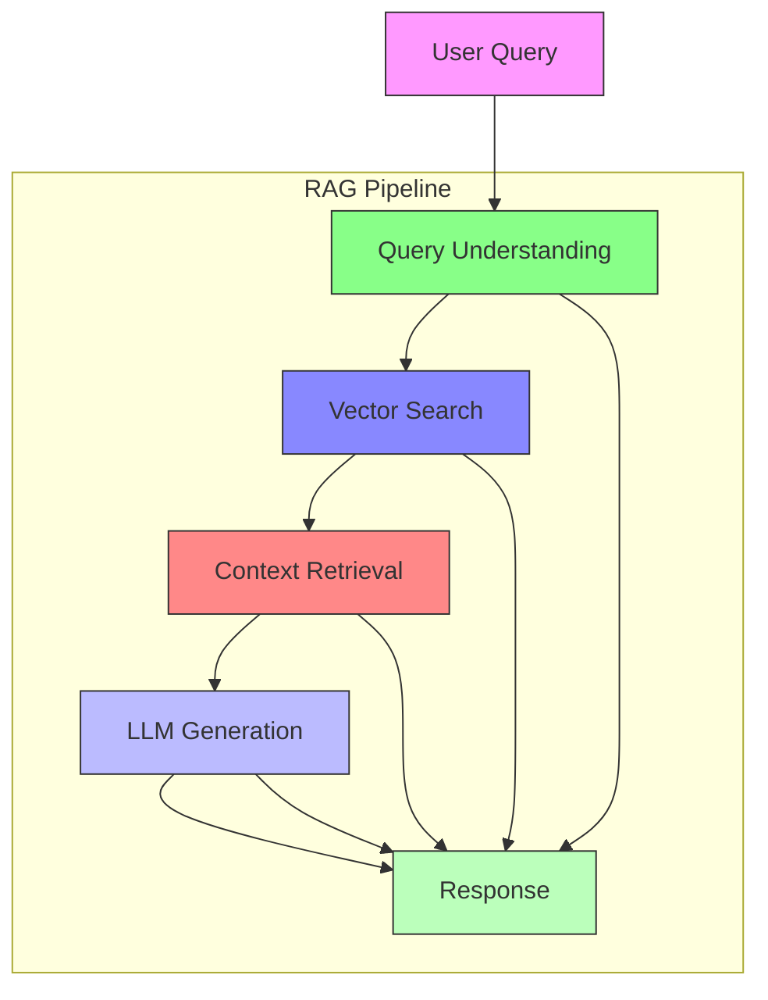

# LLM Integration & RAG: Building an Intelligent Triage Assistant

*Published: November 2025 | 45 min read | [Code on GitHub](https://github.com/yourusername/llm-triage/tree/part7)*

## Implementing Retrieval-Augmented Generation for Healthcare

In this article, we'll integrate a large language model (LLM) with our vector search system to build a Retrieval-Augmented Generation (RAG) pipeline for intelligent triage assistance.

### System Architecture



### 1. LLM Service Setup

```python
from typing import List, Dict, Any
import openai
from pydantic import BaseModel
from qdrant_client import QdrantClient

class LLMService:
    def __init__(self, model_name: str = "gpt-4-1106-preview"):
        self.model_name = model_name
        self.client = openai.OpenAI()
        self.qdrant = QdrantClient("localhost", port=6333)
        
    async def generate(
        self,
        messages: List[Dict[str, str]],
        temperature: float = 0.7,
        max_tokens: int = 1000,
    ) -> str:
        """Generate text using the LLM with error handling and retries."""
        try:
            response = await self.client.chat.completions.create(
                model=self.model_name,
                messages=messages,
                temperature=temperature,
                max_tokens=max_tokens,
            )
            return response.choices[0].message.content
        except Exception as e:
            logger.error(f"LLM generation failed: {str(e)}")
            return "I apologize, but I'm having trouble generating a response at the moment."
```

### 2. RAG Pipeline Implementation

```python
class RAGPipeline:
    def __init__(self, llm_service: LLMService, collection_name: str = "clinical_notes"):
        self.llm = llm_service
        self.collection_name = collection_name
        
    async def retrieve_context(
        self, query: str, top_k: int = 3, score_threshold: float = 0.7
    ) -> List[Dict[str, Any]]:
        """Retrieve relevant context using vector search."""
        # Generate query embedding
        query_embedding = await self.llm.get_embedding(query)
        
        # Search Qdrant
        results = self.llm.qdrant.search(
            collection_name=self.collection_name,
            query_vector=("text", query_embedding),
            limit=top_k,
            score_threshold=score_threshold,
            with_payload=True
        )
        
        return [
            {
                "text": hit.payload["text"],
                "metadata": {
                    "patient_id": hit.payload["patient_id"],
                    "note_date": hit.payload["note_date"],
                    "score": hit.score
                }
            }
            for hit in results
        ]
    
    def format_context(self, context_items: List[Dict[str, Any]]) -> str:
        """Format context for LLM prompt."""
        formatted = []
        for i, item in enumerate(context_items, 1):
            formatted.append(
                f"[Context {i}]\n"
                f"Patient ID: {item['metadata']['patient_id']}\n"
                f"Note Date: {item['metadata']['note_date']}\n"
                f"Relevance: {item['metadata']['score']:.2f}\n"
                f"Content: {item['text']}\n"
            )
        return "\n".join(formatted)
    
    async def generate_response(
        self, 
        query: str,
        conversation_history: List[Dict[str, str]] = None,
        max_context_items: int = 3
    ) -> Dict[str, Any]:
        """Generate a response using RAG."""
        # Retrieve relevant context
        context_items = await self.retrieve_context(query, top_k=max_context_items)
        
        if not context_items:
            return {
                "response": "I couldn't find enough relevant information to answer your question.",
                "context": [],
                "sources": []
            }
        
        # Format context for the prompt
        context_str = self.format_context(context_items)
        
        # Prepare the prompt
        system_prompt = """You are a helpful medical assistant. Use the provided context to answer the user's question. 
        If the context doesn't contain enough information, say so. Be concise and accurate in your responses."""
        
        user_prompt = f"""Question: {query}

Context:
{context_str}

Please provide a helpful response based on the context above."""

        # Generate response
        messages = [
            {"role": "system", "content": system_prompt},
            *conversation_history,
            {"role": "user", "content": user_prompt}
        ]
        
        response = await self.llm.generate(messages)
        
        return {
            "response": response,
            "context": context_items,
            "sources": [
                {
                    "patient_id": item["metadata"]["patient_id"],
                    "note_date": item["metadata"]["note_date"],
                    "relevance_score": item["metadata"]["score"]
                }
                for item in context_items
            ]
        }
```

### 3. Advanced RAG Techniques

#### 3.1 Query Rewriting

```python
class QueryRewriter:
    def __init__(self, llm_service: LLMService):
        self.llm = llm_service
        
    async def rewrite_query(self, query: str) -> str:
        """Use LLM to improve the search query."""
        prompt = f"""Original query: {query}
        
        Rewrite this query to be more effective for retrieving relevant medical information. 
        Focus on key medical terms and concepts. Return only the rewritten query."""
        
        messages = [
            {"role": "system", "content": "You are a helpful medical search assistant."},
            {"role": "user", "content": prompt}
        ]
        
        return await self.llm.generate(messages)
```

#### 3.2 Contextual Compression

```python
from typing import List, Dict, Any
from pydantic import BaseModel

class ContextItem(BaseModel):
    text: str
    metadata: Dict[str, Any]
    score: float

class ContextCompressor:
    def __init__(self, llm_service: LLMService):
        self.llm = llm_service
    
    async def compress_context(
        self, 
        context_items: List[ContextItem], 
        query: str,
        max_tokens: int = 2000
    ) -> List[ContextItem]:
        """Compress context to fit within token limits while preserving relevance."""
        compressed = []
        current_tokens = 0
        
        for item in sorted(context_items, key=lambda x: x.score, reverse=True):
            # Estimate token count (simplified)
            item_tokens = len(item.text.split()) * 1.3  # Rough estimation
            
            if current_tokens + item_tokens > max_tokens:
                break
                
            # Use LLM to extract only the most relevant parts
            prompt = f"""Extract only the parts of this medical note that are relevant to the query: "{query}"
            
            Medical Note:
            {item.text}
            
            Return only the relevant excerpts, or "[NOT RELEVANT]" if nothing is relevant."""
            
            messages = [
                {"role": "system", "content": "You are a helpful medical information extractor."},
                {"role": "user", "content": prompt}
            ]
            
            compressed_text = await self.llm.generate(messages)
            
            if compressed_text.strip().lower() != "[not relevant]":
                compressed.append(ContextItem(
                    text=compressed_text,
                    metadata=item.metadata,
                    score=item.score
                ))
                current_tokens += len(compressed_text.split()) * 1.3
        
        return compressed
```

### 4. API Endpoint with FastAPI

```python
from fastapi import FastAPI, HTTPException, Depends
from fastapi.middleware.cors import CORSMiddleware
from pydantic import BaseModel
from typing import List, Optional
import uvicorn

app = FastAPI(title="Healthcare Triage API")

# CORS middleware
app.add_middleware(
    CORSMiddleware,
    allow_origins=["*"],
    allow_credentials=True,
    allow_methods=["*"],
    allow_headers=["*"],
)

# Initialize services
llm_service = LLMService()
rag_pipeline = RAGPipeline(llm_service)
query_rewriter = QueryRewriter(llm_service)
context_compressor = ContextCompressor(llm_service)

class ChatRequest(BaseModel):
    message: str
    conversation_id: Optional[str] = None
    temperature: float = 0.7
    max_context_items: int = 3

class ChatResponse(BaseModel):
    response: str
    conversation_id: str
    sources: List[Dict[str, Any]]

@app.post("/chat", response_model=ChatResponse)
async def chat_endpoint(request: ChatRequest):
    try:
        # Get or create conversation history
        conversation_history = get_conversation_history(request.conversation_id)
        
        # Rewrite query for better retrieval
        rewritten_query = await query_rewriter.rewrite_query(request.message)
        
        # Get initial context
        context_items = await rag_pipeline.retrieve_context(
            rewritten_query, 
            top_k=request.max_context_items * 2  # Get extra for compression
        )
        
        # Compress context
        compressed_context = await context_compressor.compress_context(
            context_items,
            rewritten_query
        )
        
        # Generate response
        result = await rag_pipeline.generate_response(
            query=rewritten_query,
            conversation_history=conversation_history,
            max_context_items=min(len(compressed_context), request.max_context_items)
        )
        
        # Update conversation history
        update_conversation_history(
            request.conversation_id,
            {"role": "user", "content": request.message},
            {"role": "assistant", "content": result["response"]}
        )
        
        return {
            "response": result["response"],
            "conversation_id": request.conversation_id or generate_conversation_id(),
            "sources": result["sources"]
        }
        
    except Exception as e:
        logger.error(f"Error in chat endpoint: {str(e)}")
        raise HTTPException(status_code=500, detail=str(e))

if __name__ == "__main__":
    uvicorn.run("main:app", host="0.0.0.0", port=8000, reload=True)
```

### 5. Advanced Features

#### 5.1 Multi-turn Conversation

```python
class ConversationManager:
    def __init__(self):
        self.conversations = {}
        
    def get_history(self, conversation_id: str) -> List[Dict[str, str]]:
        """Get conversation history."""
        return self.conversations.get(conversation_id, [])
    
    def add_message(self, conversation_id: str, message: Dict[str, str]) -> None:
        """Add a message to the conversation history."""
        if conversation_id not in self.conversations:
            self.conversations[conversation_id] = []
        self.conversations[conversation_id].append(message)
        
    def summarize_conversation(self, conversation_id: str) -> str:
        """Generate a summary of the conversation."""
        history = self.get_history(conversation_id)
        if not history:
            return "No conversation history found."
            
        messages = [
            {"role": "system", "content": "You are a helpful assistant that summarizes conversations."},
            {"role": "user", "content": f"Please summarize this conversation:\n{history}"}
        ]
        
        # In a real implementation, you would call the LLM here
        return "Summary: " + " ".join([msg["content"] for msg in history])
```

#### 5.2 Citation and Source Verification

```python
class SourceVerifier:
    def __init__(self, llm_service: LLMService):
        self.llm = llm_service
        
    async def verify_citation(self, claim: str, source_text: str) -> Dict[str, Any]:
        """Verify if a claim is supported by the source text."""
        prompt = f"""Does the following source text support the given claim? 
        
        Claim: {claim}
        
        Source Text:
        {source_text}
        
        Return a JSON object with these fields:
        - "supported": boolean
        - "confidence": float between 0 and 1
        - "explanation": brief explanation
        
        JSON: """
        
        messages = [
            {"role": "system", "content": "You are a fact-checking assistant. Analyze if the source text supports the claim."},
            {"role": "user", "content": prompt}
        ]
        
        response = await self.llm.generate(messages)
        
        try:
            import json
            return json.loads(response.strip())
        except json.JSONDecodeError:
            return {
                "supported": False,
                "confidence": 0.0,
                "explanation": "Unable to verify the claim due to an error in processing."
            }
```

### 6. Evaluation and Monitoring

#### 6.1 RAG Evaluation

```python
from typing import List, Dict, Any
from dataclasses import dataclass

@dataclass
class RAGEvaluationResult:
    query: str
    retrieved_context: List[Dict[str, Any]]
    generated_response: str
    relevance_scores: List[float]
    latency: float
    
class RAGEvaluator:
    def __init__(self, llm_service: LLMService):
        self.llm = llm_service
        
    async def evaluate_response_quality(
        self,
        query: str,
        context: List[str],
        response: str
    ) -> Dict[str, float]:
        """Evaluate the quality of a RAG response."""
        prompt = f"""Evaluate the quality of this response to the query.
        
        Query: {query}
        
        Context:
        {chr(10).join(context)}
        
        Response:
        {response}
        
        Rate each aspect from 1-5 (5 being best):
        - Relevance: How well does the response address the query?
        - Accuracy: Is the information factually correct based on the context?
        - Completeness: Does it fully answer the query?
        - Clarity: Is the response clear and well-structured?
        
        Return a JSON object with the scores and a brief explanation."""
        
        messages = [
            {"role": "system", "content": "You are an expert evaluator of AI responses."},
            {"role": "user", "content": prompt}
        ]
        
        evaluation = await self.llm.generate(messages)
        
        try:
            import json
            return json.loads(evaluation.strip())
        except json.JSONDecodeError:
            return {
                "relevance": 3.0,
                "accuracy": 3.0,
                "completeness": 3.0,
                "clarity": 3.0,
                "explanation": "Evaluation failed due to formatting issues."
            }
```

### 7. Deployment and Scaling

#### 7.1 Docker Compose

```yaml
version: '3.8'

services:
  api:
    build: .
    ports:
      - "8000:8000"
    environment:
      - OPENAI_API_KEY=${OPENAI_API_KEY}
      - QDRANT_HOST=qdrant
      - QDRANT_PORT=6333
    depends_on:
      - qdrant
    deploy:
      resources:
        limits:
          cpus: '2'
          memory: 4G

  qdrant:
    image: qdrant/qdrant:v1.7.0
    ports:
      - "6333:6333"
      - "6334:6334"
    volumes:
      - qdrant_data:/qdrant/storage
    deploy:
      resources:
        limits:
          cpus: '2'
          memory: 8G

  prometheus:
    image: prom/prometheus:latest
    ports:
      - "9090:9090"
    volumes:
      - ./monitoring/prometheus.yml:/etc/prometheus/prometheus.yml
    command:
      - '--config.file=/etc/prometheus/prometheus.yml'

  grafana:
    image: grafana/grafana:latest
    ports:
      - "3000:3000"
    volumes:
      - grafana_data:/var/lib/grafana
    environment:
      - GF_SECURITY_ADMIN_PASSWORD=admin
    depends_on:
      - prometheus

volumes:
  qdrant_data:
  grafana_data:
```

### 8. Next Steps

In the next article, we'll cover monitoring and scaling the system in production, including:

1. **Performance Monitoring**
   - Latency tracking
   - Error rates
   - Resource utilization

2. **Quality Monitoring**
   - Response quality metrics
   - Drift detection
   - User feedback integration

3. **Scaling Strategies**
   - Horizontal scaling
   - Caching
   - Load balancing

4. **Continuous Improvement**
   - A/B testing
   - Model fine-tuning
   - Feedback loops

[Continue to Part 8: Monitoring & Scaling →](part8-monitoring-scaling.md)
