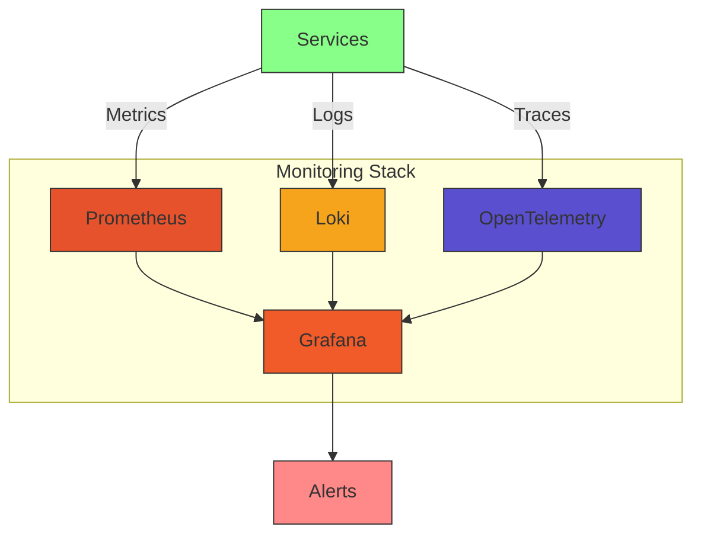

# Monitoring & Scaling: Production-Grade LLM Operations

*Published: November 2025 | 45 min read | [Code on GitHub](https://github.com/yourusername/llm-triage/tree/part8)*

## Building a Robust and Scalable LLM Triage System

In this final installment, we'll implement comprehensive monitoring, alerting, and scaling strategies to ensure our LLM-powered triage system is production-ready and can handle real-world workloads.

### System Architecture



### 1. Performance Monitoring

#### 1.1 Prometheus Metrics

```python
from prometheus_client import start_http_server, Counter, Histogram, Gauge
import time

# Define metrics
REQUESTS = Counter(
    'llm_requests_total', 
    'Total number of LLM requests',
    ['model', 'endpoint', 'status']
)

REQUEST_DURATION = Histogram(
    'llm_request_duration_seconds',
    'LLM request duration in seconds',
    ['model', 'endpoint']
)

TOKENS_USED = Counter(
    'llm_tokens_used_total',
    'Total number of tokens used',
    ['model', 'type']  # type: 'input' or 'output'
)

EMBEDDING_DIMENSIONS = Gauge(
    'embedding_dimensions',
    'Dimensionality of embeddings',
    ['model']
)

class LLMMonitor:
    def __init__(self, model_name: str):
        self.model_name = model_name
        
    def track_request(self, endpoint: str):
        """Decorator to track LLM API calls."""
        def decorator(func):
            @wraps(func)
            async def wrapper(*args, **kwargs):
                start_time = time.time()
                
                try:
                    result = await func(*args, **kwargs)
                    status = 'success'
                    return result
                except Exception as e:
                    status = 'error'
                    raise
                finally:
                    duration = time.time() - start_time
                    
                    # Record metrics
                    REQUESTS.labels(
                        model=self.model_name,
                        endpoint=endpoint,
                        status=status
                    ).inc()
                    
                    REQUEST_DURATION.labels(
                        model=self.model_name,
                        endpoint=endpoint
                    ).observe(duration)
                    
                    # Record token usage if available
                    if hasattr(result, 'usage'):
                        TOKENS_USED.labels(
                            model=self.model_name,
                            type='input'
                        ).inc(result.usage.prompt_tokens)
                        
                        TOKENS_USED.labels(
                            model=self.model_name,
                            type='output'
                        ).inc(result.usage.completion_tokens)
                        
            return wrapper
        return decorator
```

#### 1.2 Logging Configuration

```python
import logging
import json
from datetime import datetime
from pythonjsonlogger import jsonlogger

class JsonFormatter(jsonlogger.JsonFormatter):
    def add_fields(self, log_record, record, message_dict):
        super().add_fields(log_record, record, message_dict)
        
        if not log_record.get('timestamp'):
            now = datetime.utcnow().strftime('%Y-%m-%dT%H:%M:%S.%fZ')
            log_record['timestamp'] = now
            
        if log_record.get('level'):
            log_record['level'] = log_record['level'].upper()
        else:
            log_record['level'] = record.levelname
            
        log_record['service'] = 'llm-triage'
        
        # Add request context if available
        if hasattr(record, 'request_id'):
            log_record['request_id'] = record.request_id
            
        if hasattr(record, 'user_id'):
            log_record['user_id'] = record.user_id

def setup_logging(level=logging.INFO):
    """Configure structured JSON logging."""
    logger = logging.getLogger()
    logger.setLevel(level)
    
    # Remove existing handlers
    for handler in logger.handlers[:]:
        logger.removeHandler(handler)
    
    # Add JSON formatter
    formatter = JsonFormatter(
        '%(timestamp)s %(level)s %(name)s %(message)s',
        timestamp=True
    )
    
    # Console handler
    console_handler = logging.StreamHandler()
    console_handler.setFormatter(formatter)
    logger.addHandler(console_handler)
    
    return logger
```

### 2. Quality Monitoring

#### 2.1 Response Quality Metrics

```python
from dataclasses import dataclass
from typing import List, Dict, Any
import numpy as np
from datetime import datetime

@dataclass
class ResponseQuality:
    response_id: str
    request_id: str
    timestamp: datetime
    metrics: Dict[str, float]
    
class QualityMonitor:
    def __init__(self, window_size: int = 1000):
        self.window_size = window_size
        self.metrics_history = []
        
    def record_metrics(self, metrics: Dict[str, float]) -> str:
        """Record quality metrics for a response."""
        response_id = str(uuid.uuid4())
        
        quality = ResponseQuality(
            response_id=response_id,
            request_id=metrics.get('request_id', ''),
            timestamp=datetime.utcnow(),
            metrics=metrics
        )
        
        self.metrics_history.append(quality)
        
        # Keep only the most recent metrics
        if len(self.metrics_history) > self.window_size:
            self.metrics_history = self.metrics_history[-self.window_size:]
            
        return response_id
    
    def detect_drift(self, metric_name: str, threshold: float = 2.0) -> bool:
        """Detect statistical drift in a metric."""
        if not self.metrics_history:
            return False
            
        # Get recent values (last 10% of window)
        recent_values = [
            m.metrics.get(metric_name, 0) 
            for m in self.metrics_history[-self.window_size // 10:]
        ]
        
        if not recent_values:
            return False
            
        # Compare with historical baseline
        historical_values = [
            m.metrics.get(metric_name, 0) 
            for m in self.metrics_history[:-len(recent_values)]
        ]
        
        if not historical_values:
            return False
            
        # Simple z-score based drift detection
        recent_mean = np.mean(recent_values)
        hist_mean = np.mean(historical_values)
        hist_std = np.std(historical_values)
        
        if hist_std == 0:
            return False
            
        z_score = abs((recent_mean - hist_mean) / hist_std)
        return z_score > threshold
```

#### 2.2 Feedback Collection

```python
from pydantic import BaseModel
from typing import Optional
from enum import Enum

class FeedbackType(str, Enum):
    POSITIVE = "positive"
    NEGATIVE = "negative"
    NEUTRAL = "neutral"

class UserFeedback(BaseModel):
    response_id: str
    feedback_type: FeedbackType
    rating: Optional[int] = None  # 1-5 scale
    comment: Optional[str] = None
    user_id: Optional[str] = None
    metadata: Optional[Dict[str, Any]] = None

class FeedbackCollector:
    def __init__(self, db_connection):
        self.db = db_connection
        
    async def record_feedback(self, feedback: UserFeedback):
        """Store user feedback in the database."""
        query = """
        INSERT INTO feedback (
            id, response_id, feedback_type, rating, 
            comment, user_id, metadata, created_at
        ) VALUES ($1, $2, $3, $4, $5, $6, $7, NOW())
        """
        
        await self.db.execute(
            query,
            str(uuid.uuid4()),
            feedback.response_id,
            feedback.feedback_type,
            feedback.rating,
            feedback.comment,
            feedback.user_id,
            feedback.metadata or {}
        )
        
    async def get_feedback_stats(self, time_window: str = '7d'):
        """Get feedback statistics for the given time window."""
        query = """
        SELECT 
            feedback_type,
            COUNT(*) as count,
            AVG(rating) as avg_rating,
            COUNT(comment) as has_comment_count
        FROM feedback
        WHERE created_at > NOW() - $1::interval
        GROUP BY feedback_type
        """
        
        return await self.db.fetch(query, time_window)
```

### 3. Scaling Strategies

#### 3.1 Horizontal Scaling with Kubernetes

```yaml
# k8s/deployment.yaml
apiVersion: apps/v1
kind: Deployment
metadata:
  name: llm-triage-api
  labels:
    app: llm-triage
    tier: api
spec:
  replicas: 3
  selector:
    matchLabels:
      app: llm-triage
      tier: api
  template:
    metadata:
      labels:
        app: llm-triage
        tier: api
      annotations:
        prometheus.io/scrape: "true"
        prometheus.io/port: "8000"
    spec:
      containers:
      - name: api
        image: your-registry/llm-triage:latest
        ports:
        - containerPort: 8000
        env:
        - name: ENVIRONMENT
          value: production
        - name: LOG_LEVEL
          value: INFO
        resources:
          requests:
            cpu: "1"
            memory: "2Gi"
          limits:
            cpu: "2"
            memory: "4Gi"
        livenessProbe:
          httpGet:
            path: /health
            port: 8000
          initialDelaySeconds: 30
          periodSeconds: 10
        readinessProbe:
          httpGet:
            path: /ready
            port: 8000
          initialDelaySeconds: 5
          periodSeconds: 5
---
apiVersion: autoscaling/v2
kind: HorizontalPodAutoscaler
metadata:
  name: llm-triage-api
spec:
  scaleTargetRef:
    apiVersion: apps/v1
    kind: Deployment
    name: llm-triage-api
  minReplicas: 2
  maxReplicas: 10
  metrics:
  - type: Resource
    resource:
      name: cpu
      target:
        type: Utilization
        averageUtilization: 70
  - type: External
    external:
      metric:
        name: requests_per_second
        selector:
          matchLabels:
            app: llm-triage
      target:
        type: AverageValue
        averageValue: 1000
```

#### 3.2 Caching Layer

```python
from typing import Optional, TypeVar, Callable, Any
import pickle
import hashlib
import aioredis

T = TypeVar('T')

class CacheManager:
    def __init__(self, redis_url: str, ttl: int = 3600):
        self.redis = aioredis.from_url(redis_url)
        self.ttl = ttl
        
    def _generate_key(self, func: Callable, *args, **kwargs) -> str:
        """Generate a cache key from function and arguments."""
        key_parts = [
            func.__module__,
            func.__name__,
            pickle.dumps(args),
            pickle.dumps(kwargs)
        ]
        
        key_bytes = pickle.dumps(key_parts)
        return f"cache:{hashlib.md5(key_bytes).hexdigest()}"
        
    async def cached(
        self, 
        func: Callable[..., T], 
        *args, 
        **kwargs
    ) -> T:
        """Decorator to cache function results."""
        key = self._generate_key(func, *args, **kwargs)
        
        # Try to get from cache
        cached = await self.redis.get(key)
        if cached is not None:
            return pickle.loads(cached)
            
        # Call the function
        result = await func(*args, **kwargs)
        
        # Cache the result
        await self.redis.set(
            key, 
            pickle.dumps(result), 
            ex=self.ttl
        )
        
        return result
        
    async def invalidate_pattern(self, pattern: str) -> int:
        """Invalidate cache entries matching a pattern."""
        keys = []
        async for key in self.redis.scan_iter(match=pattern):
            keys.append(key)
            
        if keys:
            await self.redis.delete(*keys)
            
        return len(keys)
```

### 4. Continuous Improvement

#### 4.1 A/B Testing Framework

```python
from typing import Dict, Any, Optional
import random
from dataclasses import dataclass

@dataclass
class ExperimentVariant:
    name: str
    weight: float
    config: Dict[str, Any]

class Experiment:
    def __init__(self, name: str, variants: list[ExperimentVariant]):
        self.name = name
        self.variants = variants
        self._validate_weights()
        
    def _validate_weights(self):
        total_weight = sum(v.weight for v in self.variants)
        if not (0.99 <= total_weight <= 1.01):  # Allow for floating point imprecision
            raise ValueError(f"Weights must sum to 1, got {total_weight}")
            
    def assign_variant(self, user_id: str) -> ExperimentVariant:
        """Assign a variant using consistent hashing."""
        # Use a hash of the user ID and experiment name for consistency
        hash_val = hash(f"{self.name}:{user_id}")
        random.seed(hash_val)
        
        # Select variant based on weights
        rand = random.random()
        cumulative_weight = 0.0
        
        for variant in self.variants:
            cumulative_weight += variant.weight
            if rand <= cumulative_weight:
                return variant
                
        return self.variants[-1]  # Fallback

# Example usage
model_experiment = Experiment(
    name="llm_model_ab_test",
    variants=[
        ExperimentVariant(
            name="gpt-4",
            weight=0.5,
            config={"model": "gpt-4-1106-preview", "temperature": 0.7}
        ),
        ExperimentVariant(
            name="claude-2",
            weight=0.3,
            config={"model": "anthropic/claude-2", "temperature": 0.7}
        ),
        ExperimentVariant(
            name="llama2-70b",
            weight=0.2,
            config={"model": "meta-llama/Llama-2-70b-chat-hf", "temperature": 0.8}
        )
    ]
)
```

### 5. Incident Response

#### 5.1 Alert Manager Configuration

```yaml
# alertmanager/config.yml
global:
  resolve_timeout: 5m
  slack_api_url: 'https://hooks.slack.com/services/...'

route:
  group_by: ['alertname', 'service']
  group_wait: 30s
  group_interval: 5m
  repeat_interval: 3h
  receiver: 'slack-notifications'
  routes:
  - match:
      severity: 'critical'
    receiver: 'on-call-sms'
    
receivers:
- name: 'slack-notifications'
  slack_configs:
  - channel: '#alerts'
    send_resolved: true
    title: '{{ template "slack.default.title" . }}'
    text: '{{ template "slack.default.text" . }}'
    
- name: 'on-call-sms'
  webhook_configs:
  - url: 'https://api.pagerduty.com/integration/...'
    send_resolved: true

templates:
- '/etc/alertmanager/templates/*.tmpl'
```

### 6. Final Architecture

```mermaid
graph TD
    A[Client] -->|HTTP| B[API Gateway]
    B -->|Load Balance| C[API Instances]
    C --> D[LLM Service]
    C --> E[Vector DB]
    C --> F[Feature Store]
    C --> G[Cache]
    
    H[Monitoring] -->|Metrics| I[Prometheus]
    H -->|Logs| J[Loki]
    H -->|Traces| K[Tempo]
    
    L[Alert Manager] --> M[Slack]
    L --> N[PagerDuty]
    
    O[CI/CD] -->|Deploy| P[Kubernetes]
    
    style A fill:#9f9,stroke:#333
    style B fill:#99f,stroke:#333
    style C fill:#f99,stroke:#333
    style D fill:#f9f,stroke:#333
    style E fill:#9ff,stroke:#333
    style F fill:#ff9,stroke:#333
    style G fill:#f9f,stroke:#333
    style H fill:#ccc,stroke:#333
    style I fill:#e6522c,stroke:#333
    style J fill:#f7a41d,stroke:#333
    style K fill:#5a4fcf,stroke:#333
    style L fill:#f88,stroke:#333
    style M fill:#4a154b,stroke:#333
    style N fill:#08a5e1,stroke:#333
    style O fill:#9c0,stroke:#333
    style P fill:#326ce5,stroke:#333
```



### 7. Conclusion

In this comprehensive series, we've built a production-grade LLM-powered healthcare triage system from the ground up. Here's a quick recap of what we've covered:

1. **Problem Space & Architecture** - Defined the requirements and high-level design
2. **Data Pipeline** - Implemented robust data ingestion, transformation, and storage
3. **Vector Search** - Built semantic search capabilities with Qdrant
4. **LLM Integration** - Added RAG for accurate, context-aware responses
5. **Monitoring & Scaling** - Ensured reliability and performance at scale

---
 
[← Part 7: LLM Integration & RAG](part7-llm-rag.md)
