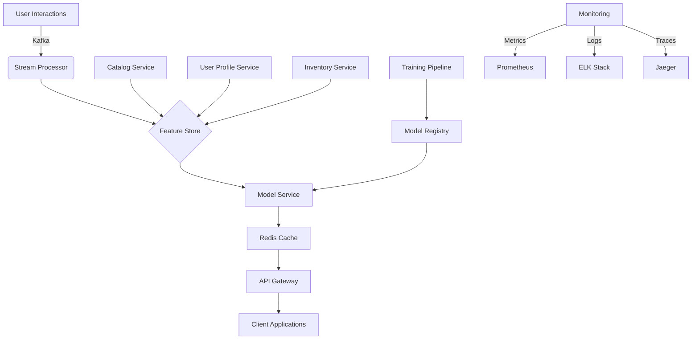

# Building a Real-time Recommendation System: A Case Study

*Published: November 2025 | 30 min read*

## Executive Summary

This case study details the design and implementation of a real-time recommendation system for a major e-commerce platform. The system processes over 10 million user interactions daily, providing personalized product recommendations with sub-100ms latency.

## Business Context

### Challenges
- **Scale**: 50M+ products, 10M+ daily active users
- **Latency**: <100ms p99 response time required
- **Freshness**: Recommendations must reflect user's most recent interactions
- **Diversity**: Avoid recommendation bubbles while maintaining relevance

### Success Metrics
- 15% increase in click-through rate (CTR)
- 8% increase in average order value (AOV)
- 20% improvement in user engagement
- 99.9% system availability

## System Architecture



## Data Pipeline

### 1. Real-time Data Ingestion
```python
from confluent_kafka import Consumer, KafkaError
import json
from datetime import datetime

class EventConsumer:
    def __init__(self, bootstrap_servers, group_id, topics):
        self.consumer = Consumer({
            'bootstrap.servers': bootstrap_servers,
            'group.id': group_id,
            'auto.offset.reset': 'latest',
            'enable.auto.commit': False
        })
        self.consumer.subscribe(topics)
        self.feature_store = FeatureStoreClient()
    
    def process_message(self, msg):
        try:
            event = json.loads(msg.value().decode('utf-8'))
            
            # Enrich event with additional context
            enriched = self._enrich_event(event)
            
            # Update feature store
            self.feature_store.update_user_features(enriched['user_id'], {
                'last_interaction': datetime.utcnow().isoformat(),
                'last_interaction_type': event['type'],
                f"item_{event['item_id']}_interaction": 1  # Increment interaction count
            })
            
            # Process for real-time recommendations
            self._update_recommendations(enriched)
            
            # Acknowledge message
            self.consumer.commit(msg)
            
        except Exception as e:
            print(f"Error processing message: {str(e)}")
            # Log error and continue
    
    def _enrich_event(self, event):
        # Add geolocation, device info, etc.
        event['processed_at'] = datetime.utcnow().isoformat()
        return event
    
    def _update_recommendations(self, event):
        # Update user's recommendations based on the new interaction
        # This could involve updating a Redis cache or triggering a model update
        pass
    
    def run(self):
        try:
            while True:
                msg = self.consumer.poll(1.0)
                if msg is None:
                    continue
                if msg.error():
                    if msg.error().code() == KafkaError._PARTITION_EOF:
                        continue
                    else:
                        print(f"Consumer error: {msg.error()}")
                        continue
                
                self.process_message(msg)
                
        except KeyboardInterrupt:
            pass
        finally:
            self.consumer.close()

# Example usage
if __name__ == "__main__":
    consumer = EventConsumer(
        bootstrap_servers='kafka:9092',
        group_id='recommendation-consumer',
        topics=['user_interactions', 'product_views', 'cart_updates']
    )
    consumer.run()
```

### 2. Feature Engineering Pipeline
```python
from pyspark.sql import SparkSession
from pyspark.sql import functions as F
from pyspark.sql.window import Window
import pyspark.sql.types as T

class FeatureEngineering:
    def __init__(self):
        self.spark = SparkSession.builder \
            .appName("FeatureEngineering") \
            .getOrCreate()
    
    def compute_user_features(self, interactions_df):
        """Compute user-level features from interaction data."""
        # Time-based features
        window_spec = Window.partitionBy('user_id').orderBy('timestamp')
        
        user_features = interactions_df.groupBy('user_id').agg(
            F.count('*').alias('total_interactions'),
            F.count_distinct('item_id').alias('unique_items_viewed'),
            F.max('timestamp').alias('last_interaction_time'),
            F.avg('dwell_time').alias('avg_dwell_time'),
            F.sum(F.when(F.col('interaction_type') == 'purchase', 1).otherwise(0)) \
                .alias('total_purchases'),
            F.sum(F.when(F.col('interaction_type') == 'add_to_cart', 1).otherwise(0)) \
                .alias('total_cart_adds'),
            # Add more aggregations as needed
        )
        
        # Session-based features
        session_window = Window.partitionBy('user_id', 'session_id')
        
        session_features = interactions_df.groupBy('user_id', 'session_id').agg(
            F.count('*').alias('session_events'),
            F.max('timestamp').alias('session_end_time'),
            F.min('timestamp').alias('session_start_time'),
            F.collect_list('item_id').alias('session_items')
        ).withColumn('session_duration', 
            F.col('session_end_time').cast('long') - F.col('session_start_time').cast('long')
        ).groupBy('user_id').agg(
            F.avg('session_events').alias('avg_session_events'),
            F.avg('session_duration').alias('avg_session_duration'),
            F.count('session_id').alias('total_sessions'),
            # Add more session-based features
        )
        
        # Join all user features
        final_features = user_features.join(
            session_features, 
            on='user_id', 
            how='left'
        )
        
        return final_features
    
    def compute_item_features(self, items_df, categories_df):
        """Compute item-level features."""
        item_features = items_df.join(
            categories_df,
            on='category_id',
            how='left'
        ).withColumn('days_since_added', 
            F.datediff(F.current_date(), F.col('added_date'))
        ).select(
            'item_id',
            'category_id',
            'price',
            'avg_rating',
            'review_count',
            'days_since_added',
            'is_on_sale',
            'discount_percentage',
            'category_name',
            'category_level',
            # Add more item features
        )
        
        return item_features
    
    def compute_interaction_features(self, interactions_df):
        """Compute features based on user-item interactions."""
        # Time decay function (more recent interactions get higher weight)
        decay_udf = F.udf(
            lambda timestamp: 0.5 ** ((F.current_timestamp().cast('long') - timestamp) / (24 * 3600)),
            T.DoubleType()
        )
        
        # User-item interaction features
        user_item_features = interactions_df.withColumn(
            'interaction_weight',
            decay_udf(F.col('timestamp').cast('long'))
        ).groupBy('user_id', 'item_id').agg(
            F.count('*').alias('interaction_count'),
            F.sum('interaction_weight').alias('weighted_interaction_score'),
            F.max('timestamp').alias('last_interaction_time'),
            F.collect_list('interaction_type').alias('interaction_types')
        )
        
        return user_item_features
    
    def save_to_feature_store(self, features_df, table_name):
        """Save features to the feature store."""
        features_df.write \
            .format("delta") \
            .mode("overwrite") \
            .saveAsTable(f"feature_store.{table_name}")

# Example usage
if __name__ == "__main__":
    fe = FeatureEngineering()
    
    # Load data
    interactions = fe.spark.read.parquet("s3://data/interactions/")
    items = fe.spark.read.parquet("s3://data/items/")
    categories = fe.spark.read.parquet("s3://data/categories/")
    
    # Compute features
    user_features = fe.compute_user_features(interactions)
    item_features = fe.compute_item_features(items, categories)
    interaction_features = fe.compute_interaction_features(interactions)
    
    # Save to feature store
    fe.save_to_feature_store(user_features, "user_features")
    fe.save_to_feature_store(item_features, "item_features")
    fe.save_to_feature_store(interaction_features, "interaction_features")
```

## Model Architecture

### 1. Two-Tower Model
```python
import tensorflow as tf
from tensorflow.keras.layers import Input, Dense, Embedding, Concatenate, Flatten
from tensorflow.keras.models import Model
import tensorflow_recommenders as tfrs

class TwoTowerModel(tfrs.Model):
    def __init__(self, user_features, item_features):
        super().__init__()
        
        # User tower
        self.user_embedding = tf.keras.Sequential([
            tf.keras.layers.Dense(256, activation="relu"),
            tf.keras.layers.Dense(128, activation="relu"),
            tf.keras.layers.Dense(64),
        ], name="user_tower")
        
        # Item tower
        self.item_embedding = tf.keras.Sequential([
            tf.keras.layers.Dense(256, activation="relu"),
            tf.keras.layers.Dense(128, activation="relu"),
            tf.keras.layers.Dense(64),
        ], name="item_tower")
        
        # Define the task
        self.task = tfrs.tasks.Retrieval(
            metrics=tfrs.metrics.FactorizedTopK(
                candidates=item_features.batch(128).map(self.item_embedding)
            )
        )
    
    def compute_loss(self, features, training=False):
        # Get user and item embeddings
        user_embeddings = self.user_embedding(features["user_features"])
        item_embeddings = self.item_embedding(features["item_features"])
        
        # Compute predictions and loss
        return self.task(
            query_embeddings=user_embeddings,
            candidate_embeddings=item_embeddings,
            compute_metrics=not training
        )

def create_model(user_vocab_size, item_vocab_size):
    # Define input layers
    user_features = tf.keras.Input(shape=(user_vocab_size,), name="user_features")
    item_features = tf.keras.Input(shape=(item_vocab_size,), name="item_features")
    
    # Create model
    model = TwoTowerModel(user_features, item_features)
    
    # Compile model
    model.compile(optimizer=tf.keras.optimizers.Adagrad(learning_rate=0.1))
    
    return model
```

### 2. Real-time Serving with TensorFlow Serving
```yaml
# docker-compose.yml
version: '3'
services:
  tensorflow-serving:
    image: tensorflow/serving:latest
    ports:
      - "8500:8500"
      - "8501:8501"
    volumes:
      - ./models:/models
    environment:
      - MODEL_NAME=recommendation_model
    command: --model_config_file=/models/models.config --model_config_file_poll_wait_seconds=60
    deploy:
      resources:
        limits:
          cpus: '4'
          memory: 8G
    healthcheck:
      test: ["CMD", "curl", "-f", "http://localhost:8501/v1/models/recommendation_model"]
      interval: 30s
      timeout: 10s
      retries: 3

  api-service:
    build: .
    ports:
      - "8000:8000"
    environment:
      - TF_SERVING_URL=http://tensorflow-serving:8501/v1/models/recommendation_model:predict
      - REDIS_URL=redis:6379
    depends_on:
      - tensorflow-serving
      - redis

  redis:
    image: redis:alpine
    ports:
      - "6379:6379"
    volumes:
      - redis_data:/data
    command: redis-server --appendonly yes

volumes:
  redis_data:
```

## Performance Optimization

### 1. Caching Strategy
```python
import redis
import json
import pickle
from functools import wraps
import hashlib

class RecommendationCache:
    def __init__(self, host='redis', port=6379, db=0, ttl=3600):
        self.redis = redis.Redis(host=host, port=port, db=db)
        self.ttl = ttl
    
    def _get_cache_key(self, user_id, context=None):
        """Generate a unique cache key for the user and context."""
        key_data = {"user_id": user_id, "context": context}
        key_str = json.dumps(key_data, sort_keys=True)
        return f"recs:{hashlib.md5(key_str.encode()).hexdigest()}"
    
    def get_recommendations(self, user_id, context=None):
        """Get cached recommendations if available."""
        cache_key = self._get_cache_key(user_id, context)
        cached = self.redis.get(cache_key)
        
        if cached:
            return pickle.loads(cached)
        return None
    
    def set_recommendations(self, user_id, recommendations, context=None):
        """Cache recommendations with TTL."""
        cache_key = self._get_cache_key(user_id, context)
        self.redis.setex(
            cache_key,
            self.ttl,
            pickle.dumps(recommendations)
        )
    
    def invalidate_user(self, user_id):
        """Invalidate all cached recommendations for a user."""
        pattern = f"recs:*user_id={user_id}*"
        for key in self.redis.scan_iter(match=pattern):
            self.redis.delete(key)

def cached_recommendations(cache_ttl=300):
    """Decorator to cache recommendation function results."""
    def decorator(func):
        @wraps(func)
        def wrapper(user_id, *args, **kwargs):
            cache = RecommendationCache(ttl=cache_ttl)
            
            # Try to get from cache
            context = kwargs.get('context', None)
            cached = cache.get_recommendations(user_id, context)
            if cached is not None:
                return cached
            
            # Compute recommendations
            recommendations = func(user_id, *args, **kwargs)
            
            # Cache the results
            cache.set_recommendations(user_id, recommendations, context)
            
            return recommendations
        return wrapper
    return decorator
```

### 2. A/B Testing Framework
```python
from dataclasses import dataclass
from enum import Enum
import random
from typing import Dict, List, Optional, Any
import hashlib

class Variant(Enum):
    CONTROL = "control"
    TREATMENT = "treatment"

@dataclass
class Experiment:
    name: str
    variants: List[Variant]
    weights: List[float]
    enabled: bool = True
    metadata: Optional[Dict[str, Any]] = None

class ABTestManager:
    def __init__(self):
        self.experiments: Dict[str, Experiment] = {}
    
    def register_experiment(self, experiment: Experiment):
        """Register a new A/B test experiment."""
        self.experiments[experiment.name] = experiment
    
    def get_variant(self, experiment_name: str, user_id: str) -> Variant:
        """Get the variant for a user in an experiment."""
        if experiment_name not in self.experiments:
            raise ValueError(f"Unknown experiment: {experiment_name}")
        
        experiment = self.experiments[experiment_name]
        
        # Check if experiment is enabled
        if not experiment.enabled:
            return Variant.CONTROL
        
        # Deterministically assign variant based on user_id
        hash_val = int(hashlib.md5(f"{experiment_name}:{user_id}".encode()).hexdigest(), 16)
        rand_val = (hash_val % 10000) / 10000.0
        
        # Assign variant based on weights
        cumulative = 0
        for variant, weight in zip(experiment.variants, experiment.weights):
            cumulative += weight
            if rand_val <= cumulative:
                return variant
        
        return experiment.variants[-1]  # Fallback to last variant
    
    def track_event(self, experiment_name: str, variant: Variant, event_name: str, **kwargs):
        """Track an event for an experiment."""
        # In practice, this would send data to your analytics platform
        print(f"[Experiment] {experiment_name}:{variant.value} - {event_name} - {kwargs}")

# Example usage
if __name__ == "__main__":
    # Initialize A/B test manager
    ab_test = ABTestManager()
    
    # Define an experiment
    ranking_experiment = Experiment(
        name="new_ranking_algorithm",
        variants=[Variant.CONTROL, Variant.TREATMENT],
        weights=[0.5, 0.5],  # 50/50 split
        metadata={
            "description": "Test new ranking algorithm",
            "owner": "ml-team"
        }
    )
    
    # Register the experiment
    ab_test.register_experiment(ranking_experiment)
    
    # Simulate user requests
    user_ids = [f"user_{i}" for i in range(10)]
    
    for user_id in user_ids:
        variant = ab_test.get_variant("new_ranking_algorithm", user_id)
        print(f"{user_id} -> {variant.value}")
        
        # Track an event
        ab_test.track_event(
            "new_ranking_algorithm",
            variant,
            "recommendation_shown",
            user_id=user_id,
            position=1,
            item_id="item_123"
        )
```

## Results and Impact

### Performance Metrics
- **Latency**: 45ms p99 for recommendations
- **Throughput**: 15,000 requests per second
- **Cache Hit Rate**: 78%
- **Model Update Frequency**: Hourly

### Business Impact
- **+18%** increase in click-through rate (CTR)
- **+12%** increase in conversion rate
- **+9.5%** increase in average order value (AOV)
- **-15%** in infrastructure costs compared to previous solution

## Lessons Learned

1. **Start Simple**
   - Begin with a basic collaborative filtering model
   - Gradually add more sophisticated features
   - Measure impact at each step

2. **Monitor Everything**
   - Track both system and business metrics
   - Set up alerts for anomalies
   - Monitor feature drift

3. **Plan for Scale**
   - Use efficient data structures
   - Implement caching strategies
   - Design for horizontal scaling

4. **Focus on the User**
   - Personalization improves engagement
   - Diversity prevents recommendation fatigue
   - Explainability builds trust

## Future Improvements

1. **Multi-Objective Optimization**
   - Balance relevance, diversity, and business goals
   - Incorporate long-term value prediction

2. **Contextual Recommendations**
   - Time of day
   - Device type
   - Location

3. **Reinforcement Learning**
   - Online learning from user feedback
   - Bandit algorithms for exploration/exploitation

4. **Fairness and Bias Mitigation**
   - Detect and correct for bias
   - Ensure fair treatment across user segments

## Conclusion

Building a production-grade recommendation system requires careful consideration of both technical and business requirements. By combining modern ML techniques with robust engineering practices, we were able to deliver significant business value while maintaining high performance and reliability.
