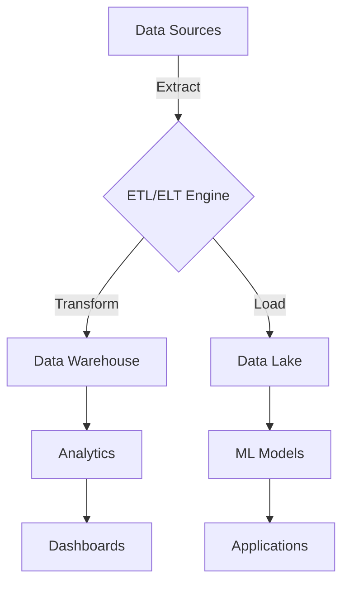

# Building Robust ETL/ELT Pipelines

*Published: November 2025 | 22 min read*

## Understanding ETL vs ELT

### ETL (Extract, Transform, Load)
- Data is transformed before loading into the target system
- Best for structured data with known schemas
- Common in traditional data warehousing

### ELT (Extract, Load, Transform)
- Data is loaded first, then transformed
- Better for unstructured/semi-structured data
- Common in modern data lakes and cloud data warehouses

## Modern ETL/ELT Architecture



## Implementation with Apache Airflow

```python
from datetime import datetime, timedelta
from airflow import DAG
from airflow.operators.python import PythonOperator
from airflow.providers.amazon.aws.hooks.s3 import S3Hook
from airflow.providers.postgres.hooks.postgres import PostgresHook
from airflow.providers.snowflake.operators.snowflake import SnowflakeOperator

def extract_data():
    """Extract data from source systems."""
    # Example: Extract from API
    import requests
    import pandas as pd
    
    response = requests.get("https://api.example.com/data")
    data = response.json()
    df = pd.DataFrame(data)
    
    # Save to S3
    s3_hook = S3Hook(aws_conn_id='aws_default')
    s3_hook.load_string(
        string_data=df.to_csv(index=False),
        key='raw/data.csv',
        bucket_name='my-data-lake',
        replace=True
    )

def transform_data():
    """Transform data using Spark."""
    from pyspark.sql import SparkSession
    from pyspark.sql.functions import col, to_date
    
    spark = SparkSession.builder \
        .appName("ETL-Transform") \
        .getOrCreate()
    
    # Read from S3
    df = spark.read.csv("s3a://my-data-lake/raw/", header=True)
    
    # Perform transformations
    transformed_df = (df
        .withColumn("date", to_date(col("timestamp")))
        .withColumn("amount", col("amount").cast("double"))
        .filter(col("status") == "completed")
    )
    
    # Write to processed zone
    (transformed_df.write
        .mode("overwrite")
        .parquet("s3a://my-data-lake/processed/")
    )

def load_to_warehouse():
    """Load processed data into Snowflake."""
    # This would be implemented as a SnowflakeOperator
    pass

# Define the DAG
default_args = {
    'owner': 'data_engineering',
    'depends_on_past': False,
    'start_date': datetime(2023, 1, 1),
    'email_on_failure': True,
    'email_on_retry': False,
    'retries': 3,
    'retry_delay': timedelta(minutes=5),
}

with DAG(
    'etl_pipeline',
    default_args=default_args,
    description='ETL pipeline for customer data',
    schedule_interval='@daily',
    catchup=False,
) as dag:
    
    extract_task = PythonOperator(
        task_id='extract_data',
        python_callable=extract_data,
    )
    
    transform_task = PythonOperator(
        task_id='transform_data',
        python_callable=transform_data,
    )
    
    load_task = SnowflakeOperator(
        task_id='load_to_warehouse',
        sql='sql/load_into_warehouse.sql',
        snowflake_conn_id='snowflake_conn',
        warehouse='COMPUTE_WH',
        database='ANALYTICS',
        schema='PUBLIC',
    )
    
    # Define dependencies
    extract_task >> transform_task >> load_task
```

## Best Practices

### 1. Idempotency
- Design pipelines to be rerunnable
- Use transaction management
- Implement upsert patterns

### 2. Error Handling
- Implement retry mechanisms
- Log detailed error messages
- Set up alerting for failures

### 3. Performance Optimization
- Partition large datasets
- Use appropriate file formats (Parquet, Avro)
- Implement incremental loading

### 4. Monitoring
- Track pipeline execution times
- Monitor data quality
- Set up dashboards for key metrics

## Modern ETL/ELT Tools

| Tool | Type | Best For | Key Features |
|------|------|----------|--------------|
| Apache Airflow | Orchestration | Complex workflows | DAG-based, Extensible |
| dbt | Transformation | Data modeling | SQL-based, Version control |
| Apache Spark | Processing | Large-scale data | Distributed computing |
| Fivetran | ELT | Cloud data | Pre-built connectors |
| Talend | ETL/ELT | Enterprise | Visual design, Governance |

## Data Pipeline Maturity Model

1. **Basic**
   - Manual processes
   - Limited automation
   - No monitoring

2. **Emerging**
   - Some automation
   - Basic scheduling
   - Simple error handling

3. **Established**
   - Automated pipelines
   - Monitoring and alerting
   - Basic data quality checks

4. **Advanced**
   - Self-healing pipelines
   - Advanced monitoring
   - Data lineage and governance

## Next Steps

1. Implement data quality checks
2. Set up monitoring and alerting
3. Document data lineage
4. Plan for scaling and performance optimization
